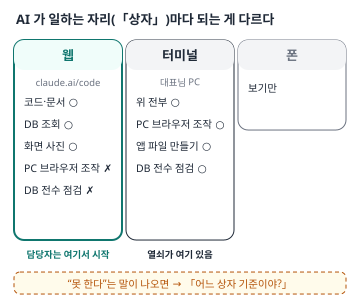
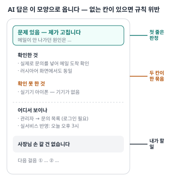
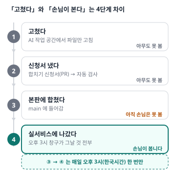
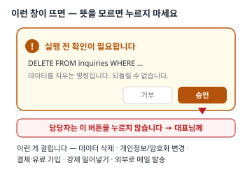

# AI(클로드 코드) 사용설명서 — 신규 담당자용

> **대상:** 개발을 해본 적 없는 새 담당자
> **핵심:** 이 문서는 **AI를 감시하는 목록이 아닙니다.** 3장의 21가지는 AI가 알아서 하기로 돼 있는 것이고, 안 지키면 AI 잘못입니다. 당신이 판단할 것은 6장뿐입니다.
> **📱 폰으로 볼 때:** https://claude.ai/code/artifact/990b2ad0-1ac6-4c04-89e3-d45a9bcccc6f
> **원본:** 이 마크다운 파일. 웹페이지는 여기서 다시 뽑는 사본입니다.

---

## 0. 30초 요약

| 이런 상황 | 이렇게 |
|---|---|
| 일을 시킬 때 | **결과물**로 말하세요 — “문의 넣으면 메일이 안 온대. 원인 찾아 고쳐줘” |
| 시킬 때 안 붙여도 되는 말 | “확인까지 해줘” “쉽게 설명해줘” “실제로 돌려봐” — **전부 기본값**(3장) |
| 답이 어렵거나 길면 | `쉽게. 두 줄로. 내가 할 일만.` |
| AI가 규칙을 어긴 것 같으면 | **4장의 문장 하나**를 보내세요 |
| 돈·삭제·보안 승인창이 뜨면 | **누르지 말고 대표님께** (6장) |

---

## 1. 이 AI가 뭐 하는 놈인가

**클로드 코드(Claude Code)** = 우리 서비스(healwith.co.kr)의 **코드를 직접 읽고 고치고 올리는** AI입니다. “이렇게 하세요”라고 알려주는 게 아니라 **자기 손으로 고치고 저장하고 배포까지** 합니다.

| 할 수 있는 것 | 못 하는 것 |
|---|---|
| 코드 읽기·고치기·새 기능 만들기 | 대표님·당신 PC의 브라우저를 대신 클릭 *(웹 세션 기준)* |
| DB 조회 — “8월 문의 몇 건?”에 **실제 숫자**로 | 본인 인증이 필요한 것 (앱스토어·은행·정부) |
| 화면 띄워 사진 찍기 (관리자 화면 포함) | 사업 판단 — 우선순위·계약·가격 |
| 문서·엑셀·PPT·한글문서 | 전화·미팅 |
| 실서비스 점검, 오류 로그 | 실기기 터치감·기기별 버그 |

### “못 한다”는 한 번 되물으세요
AI가 일하는 자리(**「상자」**)가 셋이고 각각 다릅니다.



| 상자 | 뭐가 되나 |
|---|---|
| **웹** (`claude.ai/code`) | 코드·문서·DB 다 됨. PC 브라우저는 못 건드림 |
| **터미널** (대표님 PC) | 위 전부 + PC 브라우저 조작 + 앱 파일 만들기 + **DB 전수 점검** |
| 폰 | 보기만 |

*2026-08-19: AI가 “앱 파일은 원천적으로 못 만든다”고 했는데 웹 세션 기준으로만 맞는 말이었습니다. 지금은 「어느 상자 기준인지」를 밝히게 돼 있습니다(3장 12번).*

---

## 2. 시작하기

### ① 대화창 열기
| 경로 | 어디서 | 특징 |
|---|---|---|
| **웹** | `claude.ai/code` | 설치 없음. 폰에서도 열림. **여기서 시작하세요** |
| 데스크톱 앱 | Claude 앱 (Mac·Windows) | 웹과 같은데 창이 따로 |
| 터미널 | 대표님 PC | PC 브라우저를 조작할 수 있는 유일한 자리 |

### ② 첫 문장 (복붙)
```
나 오늘부터 이 프로젝트 담당하게 된 신규 담당자야. 개발은 전혀 모른다.
docs/AI_사용설명서_신규담당자.md 랑 docs/PROJECT_CONTEXT.md 최상단 인수인계를 읽고,
지금 이 프로젝트가 어떤 상태인지 — 진행 중인 일 / 막혀 있는 일 / 내가 알아야 할 것 —
표 한 장으로 정리해줘. 전문 용어는 쉬운 말로 풀어서.
```

### ③ 배경 문서 — 있는 줄만 아세요
대화창을 열면 **현재 상태 브리핑이 AI에게 자동으로 주입**됩니다. 당신이 읽거나 물어볼 필요 없습니다.

| 문서 | 뭐가 들었나 |
|---|---|
| `docs/PROJECT_CONTEXT.md` 맨 위 | **가장 중요.** 최근 세션이 뭘 했고 왜 그렇게 결정했는지 |
| `docs/KNOWN_ISSUES.md` | 알려진 문제·다음 할 일 |
| `docs/대표님_서비스_이해_매뉴얼.md` | 서비스가 뭐 하는 건지 |
| `CLAUDE.md` + `.claude/hooks/` | **AI가 지켜야 하는 규칙** (3장이 여기서 나옵니다) |
| `docs/POSTMORTEMS.md` | 지금까지 난 사고 190여 건 |

---

## 3. AI의 약속 21가지 — 안 지키면 AI 잘못입니다

> 당신이 요구할 것이 아니라 **AI가 매번 알아서 하기로 돼 있는 것**입니다. 오른쪽은 그 규칙이 실제로 박힌 자리입니다.



*↑ 이 모양으로 옵니다. 칸이 빠져 있으면 규칙 위반이지 당신이 물어볼 일이 아닙니다.*

**보고 방식**

| # | 약속 | 규칙 |
|---|---|---|
| 1 | **쉬운 말로 답한다.** 전문 용어는 풀어서 + 원어 병기 | CLAUDE.md·말투 |
| 2 | **첫 줄은 판정.** ①문제 없음 ②내가 고친다 ③사람 손 필요 | 훅 4-1 |
| 3 | **완료 보고엔 「확인한 것 / 확인 못 한 것」 두 칸** | 훅 14 |
| 4 | **마지막은 「당신이 할 일」.** 없으면 “손 갈 것 없습니다” | 훅 14-2 |
| 5 | **구조·설계는 첫 응답부터 그림으로** | 훅 5-1 |
| 6 | **화면 고친 턴은 그 화면을 띄워 사진으로** | 훅 7-1 |
| 7 | **로봇 알림·커밋번호는 옮겨 적지 않는다** | 훅 16·4-4 |
| 8 | **본론과 곁가지를 칸 갈라서** | 훅 8-2 |

**일하는 방식**

| # | 약속 | 규칙 |
|---|---|---|
| 9 | **빌드 통과 ≠ 동작.** 실제 여정·실DB로 확인한 뒤 “됐다” | CLAUDE.md ⭐1 |
| 10 | **완료 판정 근거는 기억·문서가 아니라 그 순간의 측정** | 취향원장 |
| 11 | **폰 화면은 폰 폭(390px)으로 렌더해 재고 사진으로 보인다** | 훅 14-1 |
| 12 | **“못 한다”는 「능력」인지 「규칙」인지, 어느 상자 기준인지 밝힌다** | 훅 3-5 |
| 13 | **“내일 자동검사가 확인해줄 것”으로 미루지 않는다** | SELF_QA |
| 14 | **목록만 보고 “확인했다”고 하지 않는다.** 본문을 연다 | 훅 14-2 |
| 15 | **문서·도구를 안내할 땐 그 자리에서 돌려보고 적는다** | SELF_QA |
| 16 | **문제는 「지금 아픈 것 / 적어둘 것」으로 갈라 보고** | 취향원장 |
| 17 | **버그는 원인 + 재발방지까지 한 세트** | CLAUDE.md 7·10 |

**진행 관리**

| # | 약속 | 규칙 |
|---|---|---|
| 18 | **끝낸 일엔 「어느 화면·공개 여부·실서비스 반영 시각」** | 훅 11-1 |
| 19 | **남은 일엔 「지금 되나 / 뭘 기다리나」** | 훅 11 |
| 20 | **묶음 작업은 결정을 앞에서 다 받고 끝까지 한 뒤 한 번에 보고.** 질문 버튼은 한 화면에 하나 | 훅 3-1·3-3 |
| 21 | **새 작업 전 다른 세션과 중복인지 먼저 대조** | AUTOMERGE 3 |

---

## 4. 안 지켜졌을 때 — 외울 문장은 하나

AI도 규칙을 어깁니다(그 기록이 190여 건). 21가지 대응을 외울 필요 없습니다.

```
그거 규칙 안 지킨 거 아냐? CLAUDE.md 랑 훅 다시 보고,
뭘 어겼는지 + 왜 그랬는지 + 다시 안 그러게 뭘 할 건지까지 알려줘.
```

AI는 매 응답마다 이 규칙들을 다시 읽도록 돼 있습니다. 어겼다는 건 **읽고도 건너뛴 것**이라, 지적하면 그 자리에서 잡힙니다.

### 「다 됐습니다」는 한 번만 되물으세요
3장 9·10번이 이걸 막는 규칙인데, **실측상 사람이 한 번 되물었을 때 결함이 더 나왔습니다** — 2026-07-28 하루 세 번 되물어 **세 번 다 실제 결함**. 그러니 **중요한 게 실서비스로 나가기 전 한 번만**:

```
그거 실제로 눌러보고 하는 말이야? 확인 못 한 건 뭐야?
```

매번은 아닙니다. 끝없이 되물으면 AI는 **“방금 판 자리는 다 팠다 / 새 자리는 나온다”**로 갈라 답하게 돼 있고, 그게 정상 응답입니다.

---

## 5. 진행상황 — 4단 사다리

**“고쳤다”와 “손님이 볼 수 있다”는 네 단계 차이**입니다.



이 네 단계는 **AI가 보고에 알아서 적게 돼 있습니다**(3장 18번). 직접 확인하고 싶을 때만 주소창에 — `ok`면 살아있는 것, `commit` 값이 지금 올라가 있는 버전입니다.

```
https://healwith.co.kr/api/health
```

> **왜 하루 한 번인가:** 배포마다 돈이 나갑니다. 2026-07 실측에서 클라우드 요금의 94%가 빌드 비용, 그중 67%는 아무도 안 보는 미리보기였습니다. 장애·보안은 예외로 바로 나갑니다.

---

## 6. 사람 몫 — 이것만 당신이 판단합니다

### 6-1. 승인창이 뜨면 (기계가 실행 직전에 붙잡습니다)
뜻을 모르면 **누르지 말고 대표님께.**



| 이런 게 나오면 | 왜 |
|---|---|
| 데이터 **삭제**, 표·칸 없애기 | 되돌릴 수 없음. 실환자 자료입니다 |
| 로그인·암호화·개인정보 변경 | 환자 진단명·연락처가 들어 있습니다 |
| 유료 가입·한도 올리기·결제 | 돈이 나갑니다 |
| 강제로 밀어넣기·되돌리기 | 남의 작업이 사라질 수 있습니다 |
| 외부(병원·에이전시·환자)에 메일·메시지 발송 | 회수가 안 됩니다 |

*2026-09-08에 AI가 만든 저장 버튼이 실환자 한 명의 치료 이력을 지운 사고가 있었습니다(즉시 복구).*

### 6-2. 담당자에게 열어줄 것 — O/X만 정하면 됩니다
| 열어줄 것 | 안 열면 AI가 못 하는 것 | 판단 |
|---|---|---|
| **Claude 계정** | 대화창 자체가 안 열림 | 필수 |
| **깃허브 저장소** 읽기+쓰기 | 코드를 못 봄 = 사실상 아무것도 못 함 | 필수 |
| **관리자·코디 테스트 계정** | 로그인해야 보이는 화면을 못 확인 | 권장 |
| **DB 열쇠**(Supabase) | **「전체 훑어봐」가 통째로 안 돎.** 문의 건수 조회도 불가 | 권장하되 **터미널 세션에만.** 웹 세션엔 넣지 마세요 |
| **Vercel 토큰** | 배포 상태·빌드 로그를 직접 못 봄 | 선택 |

**가장 좁게 시작하려면** 위 두 개(Claude 계정 + 깃허브)만. 코드·문서·화면 사진·신청서까지 다 됩니다.

### 6-3. 기계가 대신 못 하는 것
우선순위 · 병원/파트너 판단 · 가격 · 대외 문구 · 실기기 터치감 · **세션을 끝낼 시점**(끝낼 때 `/handoff` 한 번)

---

## 7. 실제로 났던 사고 — 이래서 3장이 생겼습니다

> 전부 실제 사고입니다. 오른쪽은 **그래서 지금 AI가 이렇게 하게 돼 있다**는 뜻입니다.

| 이런 일이 있었다 | 그래서 지금은 |
|---|---|
| “다 했다”의 근거가 측정이 아니라 기억·문서였음 | 완료 판정은 그 순간 측정으로 (10번) |
| 고친 게 본판·실서비스엔 안 가 있었음 | 완성 보고에 실서비스 반영 시각까지 (18번) |
| 화면은 멀쩡한데 저장이 전부 실패 (위험도 95%를 0%로 표시) | 실제 여정·실DB로 확인 후 보고 (9번) |
| A를 고치며 응급 전화 동선까지 삭제 (한 달 뒤 발견) | 고치기 전 영향 반경 확인 |
| 언어 6개 중 한국어만 고쳐 러·카 환자가 영어 화면을 받음 | 전수로 훑고 가드까지 (17번) |
| 어려운 말로 설명 → “쉽게 좀 설명해줘” 반복 | 쉬운 말 + 원어 병기가 기본 (1번) |
| 글로 설명하다 세 번 왕복. 그림을 그리자 설계 결함 2개가 바로 잡힘 | 설계·흐름은 첫 응답부터 그림 (5번) |
| 봇 알림 11건을 커밋번호까지 보고 | 로봇 알림은 옮기지 않음 (7번) |
| 심사 결과를 20분마다 “아직 안 왔습니다” | 변화가 있을 때만 보고 (7번) |
| 검사 통과해놓고 초안으로 둔 채 10시간 대기 | 초록불이면 합치는 것까지 AI 몫 |
| 배포 창구 하나를 작업본 6개가 각자 고침 | 새 작업 전 중복 대조 (21번) |
| 자기가 만든 걸 “지울까요?”라고만 물음 | 묻기 전에 그게 뭔지부터 쉬운 말로 (1·12번) |
| “확인해보세요”라고 사람에게 떠넘김 | 확인은 AI가 하고 결과만 보고 |
| 한 달 전 문서로 “결제부터 하세요” → 이미 다 끝나 있었음 | 문서를 옮기기 전에 실측일부터 확인 |
| 본론과 곁가지를 같은 무게로 보고 → 통째로 잘림 | 칸을 갈라서 (8번) |

*이 문서를 만들면서 난 실수 3건(내 몫을 담당자 숙제로 적음·폰을 안 재봄·도구를 안 돌려봄)은 `docs/POSTMORTEMS.md` #194에 있습니다.*

---

## 8. 용어 사전

| 우리가 쓰는 말 | 원어 | 무슨 뜻 |
|---|---|---|
| 작업본 · 가지 | branch | AI가 작업하는 **복사본**. 실서비스엔 영향 없음 |
| 합치기 신청서 | Pull Request | “본체에 넣어도 될까요” 신청. 번호(#1234)가 붙음 |
| 본판 · 본체 | main | 진짜 코드. 여기 들어가야 배포 대상 |
| 합치기 | merge | 신청서를 본판에 넣는 것 |
| 자동 검사 | CI | 신청서마다 도는 검사. 초록불 / 빨간불 |
| 배포 | deploy | 실서비스에 반영 (오후 3시 창구) |
| 저장 기록 | commit | 작업 저장 단위. `9e1af559` 같은 번호 |
| DB | database | 환자·문의·병원 자료 저장소 |
| 인수인계 | handoff | 다음 사람이 이어받게 정리한 것 |
| 훅 | hook | AI가 매 응답마다 강제로 다시 읽는 규칙 파일 |

---

## 9. 하루 루틴

**시작 (1분)**
```
어제부터 지금까지 뭐가 달라졌어? 실서비스 이상 없어? 내가 오늘 볼 것 3개만.
```

**일 시킬 때** — 결과물로. 여러 건이면 한 번에 다 말하기.

**끝낼 때 (30초)**
```
/handoff
```

**주 1회**
```
전체 훑어봐. 허점 없어?
```
> ⚠️ 이 점검은 **DB 열쇠가 있어야 전부 돕니다.** 웹 세션에는 열쇠가 없어 그 부분이 통째로 안 돌고, AI가 「DB 쪽은 못 쟀다」고 밝히게 돼 있습니다(3장 3번). 전수로 재려면 대표님 PC 터미널 세션에서 — 6-2의 「DB 열쇠」 줄.

---

> **낡으면 고치세요.** AI에게 `이 문서에 이 내용 추가해줘`. 새 사고는 7장에 한 줄씩 쌓되 **「담당자가 이렇게 대응하세요」가 아니라 「AI가 이렇게 하게 만들었다」로** 적으세요.
