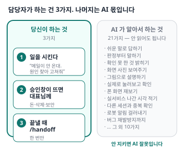

# AI(클로드 코드) 사용설명서 — 신규 담당자용

> **개발 몰라도 됩니다.** 당신이 할 일은 **3가지**뿐이고, 나머지는 AI가 알아서 합니다.
> **1~4장만 읽으면 시작할 수 있습니다.** 5장부터는 「왜 그런지」 궁금할 때 보는 참고입니다.
> 📱 폰으로 볼 때: https://claude.ai/code/artifact/990b2ad0-1ac6-4c04-89e3-d45a9bcccc6f



---

## 1. 처음 여는 법

**`claude.ai/code`** 에 들어가면 대화창이 열립니다. 설치할 것 없습니다. 폰에서도 됩니다.

들어가서 이걸 그대로 붙여넣으세요.

```
나 오늘부터 이 프로젝트 담당하게 됐어. 개발은 전혀 몰라.
지금 상황을 표 한 장으로 정리해줘. 어려운 말은 쉽게 풀어서.
```

이 한 줄이면 AI가 알아서 문서를 읽고 정리해 줍니다. 다른 준비는 없습니다.

---

## 2. ① 일 시키는 법

**「무엇이 안 된다」 또는 「무엇을 하고 싶다」만 말하면 됩니다.** 어떻게 고칠지는 AI가 정합니다.

```
환자가 문의를 넣었는데 우리한테 메일이 안 온대. 원인 찾아서 고쳐줘.
```

이렇게만 해도 AI는 원인을 찾고, 고치고, **실제로 문의를 넣어보고**, 확인한 것과 못 한 것을 나눠서 보고합니다. 그게 규칙입니다.

### 붙이지 않아도 되는 말
“확인까지 해줘” · “쉽게 설명해줘” · “실제로 돌려봐” · “그림으로 보여줘” · “다른 사람이 이거 하고 있어?”
→ **전부 AI 기본값입니다.** 붙여도 되지만, 안 붙였는데 안 지켜졌으면 그건 AI 잘못입니다.

### 여러 개를 시킬 때
한 번에 다 적으세요. 하나씩 나눠 주면 AI가 하나 하고 멈추고 하나 하고 멈춥니다.

```
아래 다 처리해줘. 중간에 보고하지 말고 끝나면 한 번에 알려줘.
1)
2)
3)
```

### 답이 어려우면 이 한마디
```
쉽게. 두 줄로. 내가 할 일만.
```

### 뭔가 이상하면 이 한마디
```
그거 규칙 안 지킨 거 아냐? 뭘 어겼는지랑 다시 안 그러게 뭘 할 건지 알려줘.
```
21가지 대응을 외울 필요 없습니다. 이 한 문장이면 AI가 스스로 찾아서 고칩니다.

---

## 3. ② 승인창이 뜨면 — 멈추세요

가끔 **“이거 실행해도 됩니까”** 하고 창이 뜹니다. 위험한 일 앞에서 기계가 자동으로 붙잡는 겁니다.


**뜻을 모르겠으면 누르지 말고 대표님께.** 이런 것들이 걸립니다.

| 이런 게 나오면 | 왜 |
|---|---|
| 자료를 **지우는** 것 | 되돌릴 수 없습니다. 실제 환자 자료입니다 |
| 로그인·개인정보 관련 | 환자 진단명·연락처가 들어 있습니다 |
| 결제·유료 가입 | 돈이 나갑니다 |
| 병원·환자에게 **메일 보내기** | 보내면 회수가 안 됩니다 |

*2026-09-08에 AI가 만든 저장 버튼이 실제 환자 한 명의 치료 기록을 지운 적이 있습니다(바로 복구).*

궁금하면 그냥 물어보세요.
```
이거 승인하면 뭐가 어떻게 되는 건지 쉽게 설명해줘.
```

---

## 4. ③ 끝낼 때 — 한 줄

대화를 마칠 때 이것만 치면 됩니다.

```
/handoff
```

오늘 뭘 했고 뭘 정했고 다음에 뭘 할지가 자동으로 정리됩니다. 다음 사람(또는 내일의 당신)이 그걸 읽고 이어갑니다.

---

> ### 여기까지가 담당자 몫입니다.
> 아래는 **읽지 않아도 되는 참고**입니다 — 「AI가 왜 저렇게 답하지?」 「이건 언제 손님한테 보이지?」가 궁금할 때만 보세요.

---

## 5. 참고 — AI 답이 오는 모양


답은 늘 이 순서입니다.

1. **첫 줄 = 판정** — 「문제 없음」 / 「내가 고칩니다」 / 「사람 손 필요」 셋 중 하나
2. **확인한 것 / 확인 못 한 것** — 두 칸이 항상 같이 옵니다. 못 잰 게 없으면 “없음”이라고 적힙니다
3. **어디서 보이나** — 어느 화면인지, 언제 실서비스에 나가는지
4. **당신이 할 일** — 없으면 “손 갈 것 없습니다”

칸이 빠져 있으면 **규칙 위반**입니다. 2장의 「뭔가 이상하면」 한마디를 보내면 됩니다.

---

## 6. 참고 — 언제 손님이 볼 수 있나

“고쳤다”와 “손님이 본다”는 다릅니다. 네 단계를 거칩니다.


이 단계는 **AI가 보고할 때 알아서 적습니다.** 당신이 물어볼 필요 없습니다.

직접 보고 싶으면 주소창에 이걸 치세요. `ok`가 뜨면 서비스가 살아있는 겁니다.
```
https://healwith.co.kr/api/health
```

> 왜 하루 한 번만 내보내나: 실서비스에 반영할 때마다 돈이 나갑니다. 2026-07 실측에서 요금의 94%가 그 비용이었고, 그중 67%는 아무도 안 보는 것이었습니다. 급한 것(장애·보안)은 예외로 바로 나갑니다.

---

## 7. 참고 — 같은 AI인데 자리마다 되는 게 다릅니다


| | **웹** (`claude.ai/code`) | **터미널** (대표님 PC) |
|---|---|---|
| 어디서 도나 | 인터넷 저쪽 **남의 컴퓨터** | **대표님 PC 안** |
| 코드는 | 받아온 **복사본** | PC에 있는 **그대로** |
| 열쇠(자료 창고 키) | **없음** | 있음 |
| 대표님 크롬 | 못 건드림 | 열고 클릭까지 됨 |
| 끝나면 | 그 컴퓨터는 **사라짐** | PC에 남음 |
| 폰에서 | 열림 | 안 됨 |

**웹으로 못 하는 건 딱 네 가지입니다** — ①자료 창고 전수 점검 ②앱 파일 만들기·스토어 올리기 ③대표님 크롬 대신 클릭 ④대표님 PC에만 있는 파일.

그래서 **“못 한다”는 말이 나오면 한 번만 되물으세요.**
```
그거 어느 자리 기준이야? 대표님 PC에서는 되는 거 아냐?
```

---

## 8. 참고 — AI가 알아서 하는 21가지

> 읽지 않아도 됩니다. **안 지켜졌을 때 「이건 원래 AI 몫이다」를 확인하는 용도**입니다.

**보고 방식**

| # | 약속 |
|---|---|
| 1 | 쉬운 말로 답한다 (전문 용어는 풀어서 + 원어 병기) |
| 2 | 첫 줄은 판정 |
| 3 | 「확인한 것 / 확인 못 한 것」 두 칸 |
| 4 | 마지막은 「당신이 할 일」, 없으면 “없습니다” |
| 5 | 구조·설계는 첫 응답부터 그림으로 |
| 6 | 화면 고친 턴은 그 화면 사진으로 |
| 7 | 로봇 알림·기계 번호는 옮겨 적지 않는다 |
| 8 | 중요한 것과 곁가지를 갈라서 |

**일하는 방식**

| # | 약속 |
|---|---|
| 9 | 「코드 통과」로 끝내지 않고 실제로 눌러보고 확인 |
| 10 | 「다 됐다」의 근거는 기억·문서가 아니라 그 자리의 측정 |
| 11 | 폰 화면은 폰 크기로 직접 재보고 사진으로 |
| 12 | “못 한다”는 「능력이 없다」인지 「규칙상 안 한다」인지 밝힌다 |
| 13 | “내일 자동검사가 해줄 것”으로 미루지 않는다 |
| 14 | 목록만 보고 “확인했다”고 하지 않는다 |
| 15 | 도구·절차를 안내할 땐 그 자리에서 돌려보고 적는다 |
| 16 | 문제는 「지금 아픈 것 / 나중에 볼 것」으로 갈라 보고 |
| 17 | 버그는 원인 + 재발 방지까지 한 세트 |

**진행 관리**

| # | 약속 |
|---|---|
| 18 | 끝낸 일엔 어느 화면·언제 실서비스에 나가는지 |
| 19 | 남은 일엔 「지금 되나 / 뭘 기다리나」 |
| 20 | 여러 건은 한 번에 물어보고 끝까지 한 뒤 한 번에 보고 |
| 21 | 새 일 시작 전 다른 사람과 겹치는지 먼저 확인 |

---

## 9. 참고 — 왜 이런 규칙이 생겼나

> 전부 실제로 났던 일입니다. 오른쪽이 **그래서 지금 AI가 이렇게 한다**는 뜻입니다.

| 이런 일이 있었다 | 그래서 지금은 |
|---|---|
| “다 했다”의 근거가 기억·문서였음 | 그 자리에서 재보고 말한다 (10) |
| 고친 게 실서비스엔 안 나가 있었음 | 나간 시각까지 적는다 (18) |
| 화면은 멀쩡한데 저장이 전부 실패 | 실제로 눌러보고 자료 창고까지 확인 (9) |
| 화면 하나 지우다 응급 전화 버튼까지 삭제 | 고치기 전 영향 범위 확인 |
| 언어 6개 중 한국어만 고쳐 러시아 환자가 영어 화면을 봄 | 전부 훑고 재발 방지까지 (17) |
| 어려운 말로 설명해 “쉽게 좀” 반복 | 쉬운 말이 기본 (1) |
| 글로 설명하다 세 번 왕복. 그림 그리자 바로 이해됨 | 처음부터 그림 (5) |
| 로봇 알림을 기계 번호까지 옮겨 적음 | 안 옮긴다 (7) |
| 결과를 20분마다 “아직 안 왔습니다” | 변화 있을 때만 (7) |
| 검사 다 끝내놓고 10시간 대기 | 초록불이면 AI가 마무리 |
| 같은 걸 여러 사람이 동시에 고침 | 시작 전 겹침 확인 (21) |
| 자기가 만든 걸 “지울까요?”라고만 물음 | 그게 뭔지부터 설명 (1·12) |
| “확인해보세요”라고 사람에게 떠넘김 | 확인은 AI가 하고 결과만 보고 |
| 한 달 전 문서로 “결제부터 하세요” → 이미 끝나 있었음 | 문서 날짜부터 확인 |
| 중요한 것과 곁가지를 섞어 보고 | 갈라서 (8) |

*이 문서를 만들며 낸 실수 3건은 `docs/POSTMORTEMS.md` #194에 있습니다.*

---

## 10. 참고 — 용어 사전

| 우리가 쓰는 말 | 원어 | 쉽게 말하면 |
|---|---|---|
| 작업본 · 가지 | branch | AI가 작업하는 **복사본**. 여기서 뭘 해도 실서비스엔 영향 없음 |
| 합치기 신청서 | Pull Request | “이 작업 넣어도 될까요” 신청서. 번호(#1234)가 붙음 |
| 본판 | main | 진짜 코드. 여기 들어가야 배포 대상 |
| 자동 검사 | CI | 신청서마다 도는 검사. 초록불 / 빨간불 |
| 배포 | deploy | 실서비스에 실제로 반영 (오후 3시 한 번) |
| 자료 창고 | DB · database | 환자·문의·병원 자료가 들어있는 곳 |
| 인수인계 | handoff | 다음 사람이 이어받게 정리한 것 |

---

## 11. 대표님용 — 담당자에게 열어줄 것

| 열어줄 것 | 안 열면 AI가 못 하는 것 | 판단 |
|---|---|---|
| **Claude 계정** | 대화창이 안 열림 | 필수 |
| **깃허브 저장소** 읽기+쓰기 | 코드를 못 봄 = 아무것도 못 함 | 필수 |
| **관리자 테스트 계정** | 로그인해야 보이는 화면을 못 봄 | 권장 |
| **자료 창고 열쇠**(Supabase) | 전수 점검·문의 건수 조회 불가 | 권장하되 **대표님 PC 터미널에만** |
| **Vercel 토큰** | 배포 기록을 직접 못 봄 | 선택 |

**가장 좁게 시작하려면** 위 두 개(Claude 계정 + 깃허브)만. 그걸로 코드·문서·화면 사진·신청서까지 다 됩니다.

기계가 대신 못 하는 것: 우선순위 · 병원/파트너 판단 · 가격 · 대외 문구 · 실기기에서만 나는 문제.

---

> 낡으면 AI에게 `이 문서에 이 내용 추가해줘` 라고 하면 됩니다. 새 사고는 9장에 한 줄씩 쌓되 **「담당자가 이렇게 하세요」가 아니라 「AI가 이렇게 하게 만들었다」로** 적으세요.
